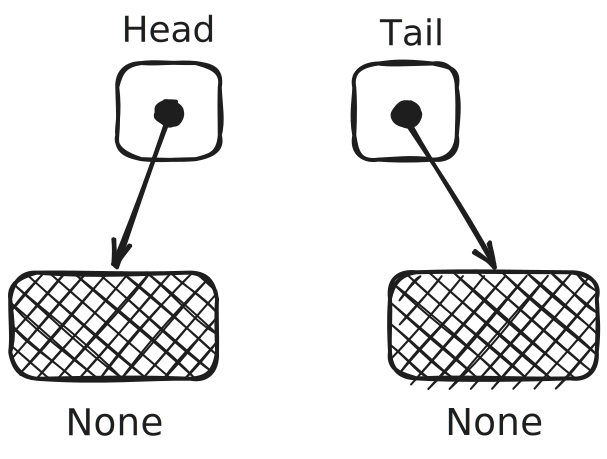
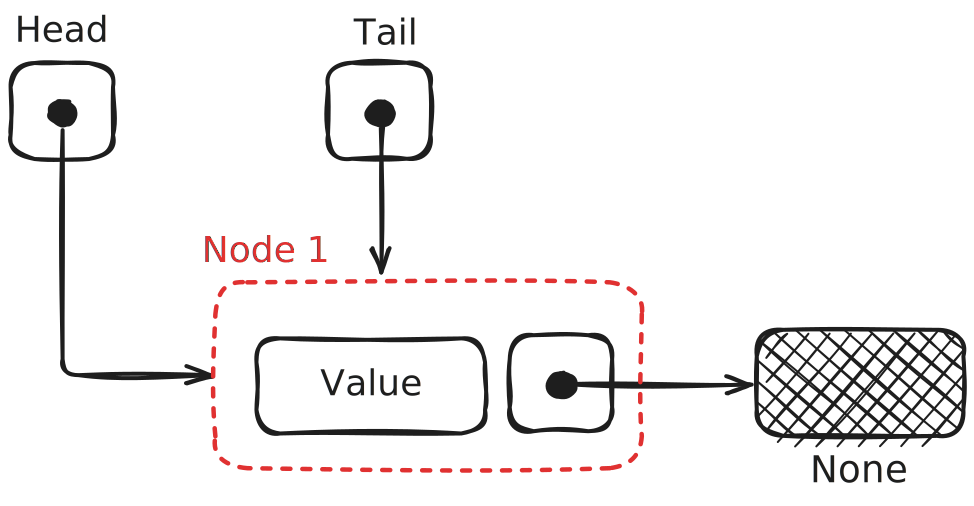
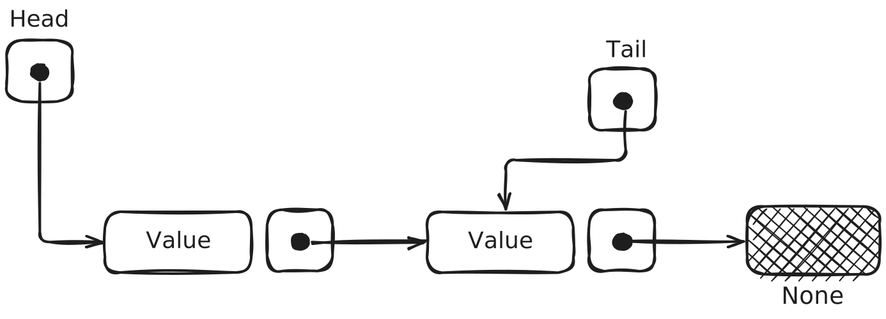

# Rc Based Linked List

链表，是一种离散内存分布的数据结构，各个节点之间通过一个指针相互链接，形成一个单向链表。其单个节点逻辑上包含两个部分：

- 这个部分的数据(value)
- 指向下一个数据的指针(next)

如下图：


尽管这在C，C++，python这样的语言里面十分容易实现，但是在Rust中，这似乎不是一件很简单的事情。

## 1. 如何建立节点的数据结构

Rust是编译型语言。Rust在编译时需要知道数据结构的具体大小，因此所有的数据结构都要是固定的。然而对于链表这种递归的数据结构，其理论上的数据大小是无穷大。当然这是编译型语言都会犯难的问题。比如如下C代码：

```c
typedef struct LINKED_LIST {
    int value;
    struct LINKED_LIST next;
} LinedList;
```

就是错误的，这时编译器会提示：

> ❌ Error: Field has incomplete type 'struct LINKED_LIST'

因为C语言也是编译型语言，需要在编译时确定大小，因此出现错误。解决方法也很简单：

```c
typedef struct LINKED_LIST {
    int value;
    struct LINKED_LIST *next;
} LinedList;
```

只要把next声名成一个指针即可，这样相当于其大小就是固定的，这里一共是8B 。

但是如果在python中，你可以这样：

```python
class LinkedList:
    def __init__(self):
        self.value = 0
        self.next = None
```

来写，因为python是解释型语言，是动态语言，不需要在编译时确定大小，所以不会出错。

但是，在Rust中呢？

Rust既没有指针，也不是动态类型语言。但我们都知道，Rust使用一种所有权借用机制，那么我们很自然地会想到用如下写法：

```rust
struct LinkedList<T> {
    value: T,
    next: &mut LinkedList<T>,
}
```

不出意外你会收到如下报错：

> ❌ Error: missing lifetime specifier expected named lifetime parameter

这是因为Rust严格管控引用的生命周期，为了防止悬空引用，Rust在检查时必须保证被指向的部分的生命周期小于等于所有者的生命周期，即：

> $$

引用的生命周期 \le 被引用者的生命周期

$$

而这里没有明确说明，因此我们必须显示声明出生命周期，如下所示：

```rust
struct LinkedList<'a, T> {
    value: T,
    next: &'a mut LinkedList<'a, T>,
}
```

目前编译器已经不报错了。那么是不是完成了？并不是，如果这时候你去初始化，你会发现你将无穷无尽地初始化下去，因为没有空的引用，所以`next`必须指向一个实例化的`LinkedList` 。
如何解决这个问题？这时候只需要使用`Option<>`这个特殊的枚举类就可以了。具体我就不解释了，直接看代码：

```rust
struct LinkedList<'a, T> {
    value: T,
    next: Option<&'a mut LinkedList<'a, T>>,
}
```

这样我们就可以通过这样的方法来初始化一个链表节点：

```rust
impl<'a, T> LinkedList<'a, T> {
    fn new(val: T) -> Self {
        LinkedList {
            value: val,
            next: None,
        }
    }
}
```

但是这时我们离成功还有很远。这时我们来看一个例子：

```rust
#[derive(Debug)]
struct LinkedList<'a, T> {
    value: T,
    next: Option<&'a mut LinkedList<'a, T>>,
}

impl<'a, T> LinkedList<'a, T> {
    fn new(val: T) -> Self {
        LinkedList {
            value: val,
            next: None,
        }
    }
}


fn main() {
    let mut x = LinkedList::<i32>::new(3);
    let mut binding = LinkedList::<i32>::new(4); // *
    x.next = Some(&mut binding); // *

    println!("{:?}", x);
}
```

首先声明，这个例子是可以运行的。但是这里又一个奇怪的地方，那就是如果你直接在图中有`*`的地方使用：

```rust
x.next = Some(&mut LinkedList::<i32>::new(4));
```

你就会发现编译器又报错了：

> ❌ Error: temporary value dropped while borrowed creates a temporary value which is freed while still in use

因为这个时候你的`LinkedList::<i32>::new(4)`是一个临时变量，而且你并未对他的所有者进行指派，所以在本行内它就会被释放，因此对他的可变借用的生命周期也是在本行内，然后根据我们之前的定义，`x`的生命周期应该小于这个可变借用，显然不符合规范，因此报错。
所以我们要先把它指派给一个变量binding，这样它和x在同一作用域，生命周期相同，所以就不会报错了。

从某种程度上来说，这算是一个解决办法，但是你会发现如果我们要创建一个长度为10的链表，那么我们需要中间变量10个！而且你还不能释放他们，因为如果他们被释放，那么他们其中之一的生命周期就会小于`x`，那么就不符合生命周期的检查。
这显然不符合我们的预期，而且非常不符合实际，如果我们需要一个$10^{20}$个元素的链表，是不是要创建$10^{20}$个中间变量？

> ## ✨ Rust的安全性和开发负担
>
> 这正是Rust安全性带来的开发负担。如果在C语言中，你大可以不用关心，如果你足够自信你可以规避 **“悬空引用”** 和 **“忘记释放带来的内存浪费”**。事实上这还是十分难以避免的，毕竟人在编程的时候是很脆弱的(bushi)，我们举一个例子：
>
> ```c
> #include <stdio.h>
> #include <stdlib.h>
>
> typedef struct LINKED_LIST {
>     int value;
>     struct LINKED_LIST *next;
> } LinkedList;
>
> void foo1() {
>     LinkedList x = {0, NULL};
>
>     for (int i = 1; i <= 5; ++i) {
>         LinkedList *y = (LinkedList *)malloc(sizeof(LinkedList));
>         y->value = i;
>         LinkedList *p = &x;
>         while (p->next != NULL) {
>             p = p->next;
>         }
>
>         p->next = y;
>     }
>
>     LinkedList *p = &x;
>     while (p != NULL) {
>         printf("%d -> ", p->value);
>         p = p->next;
>     }
>
>     printf("ended\n");
> }  // you forget free the RAM of heap
>
> void foo2() {
>     LinkedList x = {0, NULL};
>
>     for (int i = 1; i <= 5; ++i) {
>         LinkedList y = {i, NULL};
>         LinkedList *p = &x;
>         while (p->next != NULL) {
>             p = p->next;
>         }
>
>         p->next = &y;
>     }  // {i, NULL} released, x->next pointed to a invalid RAM
>
>     LinkedList *p = &x;
>     while (p != NULL) {
>         printf("%d -> ", p->value);
>         p = p->next;
>     }
>
>     printf("ended\n");
> }
>
> int main(int argc, char *argv[]) {
>     foo1();
>     return 0;
> }
> ```
>
> 这里`foo1`就是忘记释放内存，`foo2`就是悬空引用。

事实上我们刚刚一直在做一件蠢事：把链表存储在栈内存上。在栈上，我们无法控制它的生命周期，无论在rust还是在C语言里。比如，如果我们把插入操作包装到函数里，等跳出函数，无论C还是Rust都会释放掉栈内存中的临时数据，这样无论如何都无法在函数弹栈之后保留我们的链表。

因此救赎之道就在其中，我们需要申请堆内存。在C语言中我们有malloc；C++中我们使用new；然而在Rust中，这个任务就交给智能指针了。这里对于智能指针的选择有如下几种，优劣如下：

1. `Box<>`

- 优势：
  - 相比于`Rc<RefCell<>>`非常轻量，在插入，删除的操作中比`Rc<RefCell<>>`表现好。
- 劣势：
  - 无法引入尾指针，导致对尾部的插入复杂度变为$O(n)$。

2. `Rc<RefCell<>>`

- 优势：
  - 可以使用尾指针，因为`Rc`允许我们对同一块数据进行计数引用，而`RefCell`提供了对数据的更改权限。这使得我们可以高效地在尾部插入数据，可以提供更高效的链表队列。
  - 可以在中间加入指针，提升查找效率一倍。
  - 可以实现获取原链表所有权的迭代器，而不会消耗原链表的所有权，这是`Rc`指针的特性。
- 劣势：
  - 由于其计数引用的设计增加了运行时的负担，导致它在普通操作的时候性能大打折扣。

3. `NonNull` (官方库的选择)

- 优势：
  - 非常高效，是对于裸指针的一个非空包装，即保证安全，又具有效率。
  - 解决了`Box<>`的问题，可以实现$O(1)$级的尾插。
- 劣势：
  - 需要显式管理生命周期，实现困难。
  - 需要管理裸指针，包含`unsafe`的部分，安全性不如前两者。


在此处，我们选择`Rc<RefCell<>>`，至此我们的数据结构就初具雏形了：

```rust
pub struct LinkedListNode<T> {
    value: T,
    next: Option<Rc<RefCell<LinkedListNode<T>>>>,
}
```

除了这种写法之外，这里还有几种常见的写法，各有优劣，大家自行考察：

1. 使用枚举，代替Option

```rust
enum LinkedListNode<T> {
    Cons(val: T, next: Box<LinkedListNode<T>>),
    Nil
}
```

2. 基于Box指针而不是Rc指针，节省开销([boxed version](./box_linked_list.md))

这样就不会有尾指针，使得对尾部插入的操作时间复杂度上升。

```rust
struct LinkedListNode<T> {
    value: T,
    next: Option<Box<LinkedListNode<T>>>,
}
```

3. 基于NonNull指针，节省开销，但是要手动管理生命周期，不是很好，所以不推荐

详细请参考[Rust Algorthm](https://github.com/TheAlgorithms/Rust/blob/master/src/data_structures/linked_list.rs).

```rust
pub struct LinkedListNode<T> {
    val: T,
    next: Option<NonNull<Node<T>>>,
}
```

## 2. 如何建立LinkedList的数据结构

事实上我们希望得到的是一个被封装好的，可以支持我们方便地进行增删改查以及获取各种数据信息比如长度的数据结构。因此我们需要一些额外字段来包装我们的裸链表节点。首先是需要一个头指针，指向真正的数据部分，这部分是必要的。然后为了增加尾部插入的效率，我们加入了`tail`指针，这样会免去查找到最后一个节点的步骤，从而把尾部插入的复杂度降到$O(1)$。以下是我们真正的`LinkedList<T>`的数据结构，以及各种操作的名称和复杂度的概览：

```rust
pub struct LinkedList<T> {
    len: usize,                                   // The length of the list.
    head: Option<Rc<RefCell<LinkedListNode<T>>>>, // An Optioned rc reference to the first node in the list.
    tail: Option<Rc<RefCell<LinkedListNode<T>>>>, // An Optioned rc reference to the last node in the list.
}
```

### 2.1. 各种操作

| 操作 | 函数名 | 时间复杂度 | 返回值 |
|---|---|:---:|---|
| 头插 | push_head | O(1) | () |
| 尾插 | push_back | O(1) | () |
| 头删 | pop_head | O(1) | 1. Ok(T) <br> 2. LinkedListError::EmptyList |
| 尾删 | pop_back | O(1) | 1. Ok(T) <br> 2. LinkedListError::EmptyList |
| 插入 | insert | O(n) | 1. Ok(()) <br> 2. LinkedListError::InsertOutOfRange |
| 删除 | remove | O(n) | 1. Ok(T) <br> 2. LinkedListError::RemoveOutOfRange <br> 3. LinkedListError::RemoveFromEmptyList |
| 逆向查找 | val2ix | O(n) | Vec\<usize> |
| 查找 | ix2val & get | O(n) | Option\<T> |
| 获取长度 | len | O(1) | self.len |
| 清除 | clean | O(n) | () |
| 获取不移交所有权的迭代器 | no_move_into_iter | O(1) | LinkedListIterator\<T> |

### 2.2. 各种错误对应的情况

| 错误类型 | 对应情况 |
|---|---|
| `LinkedListError::EmptyList` | 当进行 **pop_head** 或 **pop_back** 操作时，若链表为空，则返回此错误。 |
| `LinkedListError::InsertOutOfRange` | 当 **insert** 要插入元素的位置没有在$[0, len]$，返回此错误。 |
| `LinkedListError::RemoveOutOfRange` | 当 **remove** 要删除的位置没在$[0, len)$，返回此错误。 |
| `LinkedListError::RemoveFromEmptyList` | 当进行 **remove** 操作时，如果链表为空，则返回此错误。 |
| `LinkedListError::RemoveWhileNextIsNone` | 在进行链表遍历时，如果 `next` 指针为 `None`，则返回此错误，表示链表结束或发生其他错误。 |

### 2.3. 各种长度对应的链表的数据形态

#### # `len == 0`

<div style="text-align: center;">
    
</div>

#### # `len == 1`

<div style="text-align: center;">
    
</div>

#### # `len >= 2`

<div style="text-align: center;">
    
</div>

### 2.4. 数据操作

在这里，我们将`Rc<RefCell<>>`指针所指向的内存称为“数据”。这里我们的指针类型是`Option<Rc<RefCell<LinkedListNode<T>>>>`，因而如果我们想要进行一些例如获取`next`，修改`value`的操作等，就要从这个“层层包装”的数据结构中解构并做我们想做的事情；而且不得不说对于`Rc`的操作是比较麻烦的，因为这时的所有权并不只是转移，还会增加，出现多个所有者的情况。以下是一些常见的操作：

#### # 获取节点的属性值

如果我们得到了一个指向某块内存的`Rc`指针`ptr`，那么我们可以使用`borrow()`和`borrow_mut()`方法来获取它们指向内存的可变/不可变引用。比如我使用`let x = ptr.borrow()`，那么`x`此时就是对数据的不可变引用，可以进行不可变引用的一切操作。

#### # 修改指针的指向

我们在修改一个`Rc`指针`ptr`的指向数据A的时候，事实上我们经历的过程是：

1. 制造一个指向目标数据A的`Rc`指针`ptr1`，或者获取一个已经指向该数据的`Rc`指针`ptr2`的所有权。数据A的计数引用加一。
2. 将`ptr1`或者`ptr2`的所有权移交给`ptr`。`ptr`指向数据的计数引用减一。

通常我们用来制造一个指向已经存在某个引用`ptr`的数据的`Rc`指针的方法是使用：

```rust
let new_ptr = ptr.clone();
```

#### # `LinkedListNode<T>`的插入和删除

插入和删除是被封装在`LinkedListNode<T>`的方法里面的。这两个操作都是对于当前节点的下一个节点而进行的，而且对于删除，由于我们无法在$O(1)$的时间内找到前一个数据的位置，因此也只能操作后一个位置的数据。

- **插入**：

1. 创建一个`node(value)`，获取`self.next.clone()`，**后一个数据的计数引用 == 2**。
2. 创建一个关于`node`的`Rc<RefCell<T>>`并把所有权移交给`self.next`，此时 **`node`的计数引用 == 1**；**原来的后一个数据的计数引用 == 1**。

    ```rust
    pub fn insert(&mut self, val: T) {
        let node = LinkedListNode::new(val, self.next());
        self.next = Some(Rc::new(RefCell::new(node)));
    }
    ```

- **删除**：

    删除比插入多一点步骤，就是如果后面是`None`，那么就要扔出错误。假设要删除数据是A，那么其过程如下：

1. 检查`self.next`是不是一个`None`，如果是直接报错。
2. 把`self.next`给`take()`出来并解包，放在另一个变量`ptr`里。这个`ptr`就是一个指向要删除数组的`Rc`指针。A的计数引用不变，但是`self.next`失去所有权，`ptr`获得所有权。
3. 把`ptr.borrow_mut().next.take()`移交给`self.next`。把A的next的所有权移交给`self.next`。
4. 克隆`ptr.borrow.value`，封装到`Ok()`里面返回。出作用域之后，由于`ptr`被释放，所指向的数据没有引用了，因而会被释放。


#### # `LinkedList<T>`的遍历

对于用`Rc`指针实现的链表的遍历相对简单，因为我们不用考虑复杂的所有权转移问题，我们可以像在C语言中一样使用一个辅助指针来逐步移动。我们假设下一个节点不是`None`，则其移动一次只需要：

```rust
let wraped_ptr = self.head.clone();  // 辅助指针
let x = wraped_ptr.as_ref().unwrap().borrow().next.clone();
wraped_ptr = x;
```

即可。至于这里为什么要使用中间变量`x`，那是因为如果将它们写到一行，由于我们借用了`wraped_ptr`，因而在解除借用之前（临时变量，作用域在本行之内），我们不允许修改wraped_ptr。另外也可以从生命周期的角度理解这个问题，详见：[Rust借用机制引发的一个小bug ](https://gist.github.com/HugoPhi/396b5428776b074908668c98e0dd1c76).

> ❌ Error: cannot assign to `wraped_ptr` because it is borrowed `wraped_ptr` is assigned to here but it was already borrowed.

## 3. 如何实现迭代器

迭代器和迭代修饰器是Rust里一大利器。他让我们很方便地取代循环操作。在`Rc`中，我们只需要实现以下迭代器：

- `into_iter()`，消耗所有权，逐步给出原链表里面的值，通过实现IntoIterator的Trait。
- `no_move_iter()`，不消耗所有权，逐步给出原链表里面值的克隆，通过自定义函数iter实现。

而不需要实现诸如借用迭代器，可变借用迭代器等等。因为`Rc`允许我们让一个数据有多个所有者。

## 4. 可优化的空间

### 4.1. 查找(ix2val)

这里由于允许我们在一块数据建立多个指针引用，因此我们可以在中间放入一个指针`mid`，我们可以通过判断索引来确定到底时候要从`mid`开始查找，这样效率会提升近一倍。这个`mid`换算成索引就是：


$$

\text{mid} = \lfloor {\text{len}\over 2} \rfloor

$$

但是这样也会带来维护的负担：

1. 插入：需要把`mid`向后移动$\text{mid}_{new} - \text{mid}_{old}$个。
2. 删除：需要从头找到新的`mid`的位置。


总的来说，维护负担期望是：


$$

\begin{align}

\mathbb{E}_{维护} &= {1\over 2} \cdot O({n\over 2}) + {1\over 2} \cdot O(1) \\
&= O({n \over 4}) \\

\end{align}

$$
