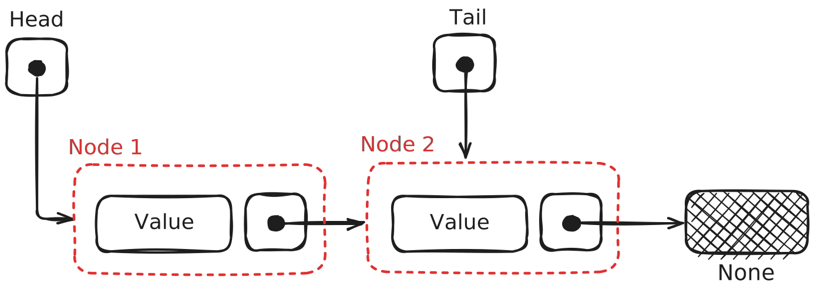

# Rc Based Linked List

链表，是一种离散内存分布的数据结构，各个节点之间通过一个指针相互链接，形成一个单向链表。其单个节点逻辑上包含两个部分：

- 这个部分的数据(value)
- 指向下一个数据的指针(next)

如下图：


尽管这在C，C++，python这样的语言里面十分容易实现，但是在Rust中，这似乎不是一件很简单的事情。

## 1. 如何建立节点的数据结构

Rust是编译型语言。Rust在编译时需要知道数据结构的具体大小，因此所有的数据结构都要是固定的。然而对于链表这种递归的数据结构，其理论上的数据大小是无穷大。当然这是编译型语言都会犯难的问题。比如如下C代码：

```c
typedef struct LINKED_LIST {
    int value;
    struct LINKED_LIST next;
} LinedList;
```

就是错误的，这时编译器会提示：

> Field has incomplete type 'struct LINKED_LIST'

因为C语言也是编译型语言，需要在编译时确定大小，因此出现错误。解决方法也很简单：

```c
typedef struct LINKED_LIST {
    int value;
    struct LINKED_LIST *next;
} LinedList;
```

只要把next声名成一个指针即可，这样相当于其大小就是固定的，这里一共是8B 。

但是如果在python中，你可以这样：

```python
class LinkedList:
    def __init__(self):
        self.value = 0
        self.next = None
```

来写，因为python是解释型语言，是动态语言，不需要在编译时确定大小，所以不会出错。

但是，在Rust中呢？

Rust既没有指针，也不是动态类型语言。但我们都知道，Rust使用一种所有权借用机制，那么我们很自然地会想到用如下写法：

```rust
struct LinkedList<T> {
    value: T,
    next: &mut LinkedList<T>,
}
```

不出意外你会收到如下报错：

> missing lifetime specifier expected named lifetime parameter

这是因为Rust严格管控引用的生命周期，为了防止悬空引用，Rust在检查时必须保证被指向的部分的生命周期小于等于所有者的生命周期，即：

$$

引用的生命周期 \le 被引用者的生命周期

$$

而这里没有明确说明，因此我们必须显示声明出生命周期，如下所示：

```rust
struct LinkedList<'a, T> {
    value: T,
    next: &'a mut LinkedList<'a, T>,
}
```

目前编译器已经不报错了。那么是不是完成了？并不是，如果这时候你去初始化，你会发现你将无穷无尽地初始化下去，因为没有空的引用，所以next必须指向一个实例化的LinkedList 。
如何解决这个问题？这时候只需要使用Option\<>这个特殊的枚举类就可以了。具体我就不解释了，直接看代码：

```rust
struct LinkedList<'a, T> {
    value: T,
    next: Option<&'a mut LinkedList<'a, T>>,
}
```

这样我们就可以通过这样的方法来初始化一个链表节点：

```rust
impl<'a, T> LinkedList<'a, T> {
    fn new(val: T) -> Self {
        LinkedList {
            value: val,
            next: None,
        }
    }
}
```

但是这时我们离成功还有很远。这时我们来看一个例子：

```rust
#[derive(Debug)]
struct LinkedList<'a, T> {
    value: T,
    next: Option<&'a mut LinkedList<'a, T>>,
}

impl<'a, T> LinkedList<'a, T> {
    fn new(val: T) -> Self {
        LinkedList {
            value: val,
            next: None,
        }
    }
}


fn main() {
    let mut x = LinkedList::<i32>::new(3);
    let mut binding = LinkedList::<i32>::new(4); // *
    x.next = Some(&mut binding); // *

    println!("{:?}", x);
}
```

首先声明，这个例子是可以运行的。但是这里又一个奇怪的地方，那就是如果你直接在图中有`*`的地方使用：

```rust
x.next = Some(&mut LinkedList::<i32>::new(4));
```

你就会发现编译器又报错了：

> temporary value dropped while borrowed creates a temporary value which is freed while still in use

因为这个时候你的`LinkedList::<i32>::new(4)`是一个临时变量，而且你并未对他的所有者进行指派，所以在本行内它就会被释放，因此对他的可变借用的生命周期也是在本行内，然后根据我们之前的定义，x的生命周期应该小于这个可变借用，显然不符合规范，因此报错。
所以我们要先把它指派给一个变量binding，这样它和x在同一作用域，生命周期相同，所以就不会报错了。

从某种程度上来说，这算是一个解决办法，但是你会发现如果我们要创建一个长度为10的链表，那么我们需要中间变量10个！而且你还不能释放他们，因为如果他们被释放，那么他们其中之一的生命周期就会小于x，那么就不符合生命周期的检查。
这显然不符合我们的预期，而且非常不符合实际，如果我们需要一个$10^{20}$个元素的链表，是不是要创建$10^{20}$个中间变量？

> ## Rust的安全性和开发负担
>
> 这正是Rust安全性带来的开发负担。如果在C语言中，你大可以不用关心，如果你足够自信你可以规避 **“悬空引用”** 和 **“忘记释放带来的内存浪费”**。事实上这还是十分难以避免的，毕竟人在编程的时候是很脆弱的(bushi)，我们举一个例子：
>
> ```c
> #include <stdio.h>
> #include <stdlib.h>
>
> typedef struct LINKED_LIST {
>     int value;
>     struct LINKED_LIST *next;
> } LinkedList;
>
> void foo1() {
>     LinkedList x = {0, NULL};
>
>     for (int i = 1; i <= 5; ++i) {
>         LinkedList *y = (LinkedList *)malloc(sizeof(LinkedList));
>         y->value = i;
>         LinkedList *p = &x;
>         while (p->next != NULL) {
>             p = p->next;
>         }
>
>         p->next = y;
>     }
>
>     LinkedList *p = &x;
>     while (p != NULL) {
>         printf("%d -> ", p->value);
>         p = p->next;
>     }
>
>     printf("ended\n");
> }  // you forget free the RAM of heap
>
> void foo2() {
>     LinkedList x = {0, NULL};
>
>     for (int i = 1; i <= 5; ++i) {
>         LinkedList y = {i, NULL};
>         LinkedList *p = &x;
>         while (p->next != NULL) {
>             p = p->next;
>         }
>
>         p->next = &y;
>     }  // {i, NULL} released, x->next pointed to a invalid RAM
>
>     LinkedList *p = &x;
>     while (p != NULL) {
>         printf("%d -> ", p->value);
>         p = p->next;
>     }
>
>     printf("ended\n");
> }
>
> int main(int argc, char *argv[]) {
>     foo1();
>     return 0;
> }
> ```
>
> 这里`foo1`就是忘记释放内存，`foo2`就是悬空引用。

事实上我们刚刚一直在做一件蠢事：把链表存储在栈内存上。在栈上，我们无法控制它的生命周期，无论在rust还是在C语言里。比如，如果我们把插入操作包装到函数里，等跳出函数，无论C还是Rust都会释放掉栈内存中的临时数据，这样无论如何都无法在函数弹栈之后保留我们的链表。

因此救赎之道就在其中，我们需要申请堆内存。然而在Rust中，这个任务就交给智能指针了。这里我们选用了Rc\<RefCell\<>>作为智能指针，原因有两点：

- 可以加入尾指针，方便高频的尾部插入操作
- 可以方便地实现借用迭代器方法

因此我们的数据结构就初具雏形了：

```rust
pub struct LinkedListNode<T> {
    value: T,
    next: Option<Rc<RefCell<LinkedListNode<T>>>>,
}
```

除了这种写法之外，这里还有几种写法，各有优劣，大家自行考察：

1. 使用枚举，代替Option

```rust
enum LinkedListNode<T> {
    Cons(val: T, next: Box<LinkedListNode<T>>),
    Nil
}
```

2. 基于Box指针而不是Rc指针，节省开销

这样就不会有尾指针。使得对尾部插入的操作时间复杂度上升。而且此时借用迭代器要另外实现一个迭代器类型，就是对头指针的引用。然后利用引用来不断访问值。

```rust
struct LinkedListNode<T> {
    value: T,
    next: Option<Box<LinkedListNode<T>>>,
}
```

此时借用迭代器就是：

```rust
struct BorrowMutIterator<'a, T> {
    curr: Option<&'a mut LinkedListNode<T>>,
}
```

3. 基于NonNull指针，节省开销，但是要手动管理生命周期，不是很好，所以不推荐

详细请参考[Rust Algorthm](https://github.com/TheAlgorithms/Rust/blob/master/src/data_structures/linked_list.rs)

```rust
pub struct Node<T> {
    pub val: T,
    pub next: Option<NonNull<Node<T>>>,
    prev: Option<NonNull<Node<T>>>,
}
```

## 2. 如何建立LinkedList的数据结构

事实上我们希望得到的是一个被封装好的，可以支持我们方便地进行增删改查以及获取各种数据信息比如长度的数据结构。因此我们需要一些额外字段来包装我们的裸链表节点。首先是需要一个头指针，指向真正的数据部分，这部分是必要的。然后为了增加尾部插入的效率，我们加入了`tail`指针，这样会免去查找到最后一个节点的步骤，从而把尾部插入的复杂度降到$O(1)$。以下是我们真正的`LinkedList<T>`的数据结构，以及各种操作的名称和复杂度的概览：

```rust
pub struct LinkedList<T> {
    len: usize,                                   // The length of the list.
    head: Option<Rc<RefCell<LinkedListNode<T>>>>, // A reference to the first node in the list.
    tail: Option<Rc<RefCell<LinkedListNode<T>>>>, // A reference to the last node in the list.
}
```

### 2.1. 各种操作

| 操作 | 函数名 | 时间复杂度 | 返回值 |
|---|---|:---:|---|
| 头插 | push_head | O(1) | () |
| 尾插 | push_back | O(1) | () |
| 头删 | pop_head | O(1) | 1. Ok(T) <br> 2. LinkedListError::EmptyList |
| 尾删 | pop_back | O(1) | 1. Ok(T) <br> 2. LinkedListError::EmptyList |
| 插入 | insert | O(n) | 1. Ok(()) <br> 2. LinkedListError::InsertOutOfRange |
| 删除 | remove | O(n) | 1. Ok(T) <br> 2. LinkedListError::RemoveOutOfRange <br> 3. LinkedListError::RemoveFromEmptyList |
| 逆向查找 | val2ix | O(n) | Vec\<usize> |
| 查找 | ix2val & get | O(n) | Option\<T> |
| 获取长度 | len | O(1) | self.len |
| 清除 | clean | O(n) | () |
| 获取迭代器 | no_move_iter | O(1) | LinkedListIterator\<T> |

### 2.2. 各种错误对应的情况

| 错误类型 | 对应情况 |
|---|---|
| `LinkedListError::EmptyList` | 当进行 **pop_head** 或 **pop_back** 操作时，若链表为空，则返回此错误。 |
| `LinkedListError::InsertOutOfRange` | 当 **insert** 要插入元素的位置没有在$[0, len]$，返回此错误。 |
| `LinkedListError::RemoveOutOfRange` | 当 **remove** 要删除的位置没在$[0, len)$，返回此错误。 |
| `LinkedListError::RemoveFromEmptyList` | 当进行 **remove** 操作时，如果链表为空，则返回此错误。 |
| `LinkedListError::NextIsNone` | 在进行链表遍历时，如果 `next` 指针为 `None`，则返回此错误，表示链表结束或发生其他错误。 |

### 2.3. 各种长度对应的链表的数据形态

#### `len == 0`

<div style="text-align: center;">
    
</div>

#### `len == 1`

<div style="text-align: center;">
    
</div>

#### `len >= 2`

<div style="text-align: center;">
    
</div>

## 3. 如何实现迭代器

迭代器和迭代修饰器是Rust里一大利器。他让我们很方便地取代循环操作。这里我们要自己实现一个关于LinkedListNode的迭代器，有两种制造函数的实现：

- `into_iter()`，消耗所有权，通过实现IntoIterator的Trait。
- `no_move_iter()`，借用，通过自定义函数iter实现。

因为我们使用了可计数指针，因此我们就可以让我们的迭代器包含一个指向某个节点的指针。用这个指针来实现队节点的逐个访问，通过实现Iterator Trait来做这个事情。

```rust
pub struct LinkedListIterator<T> {
    curr: Option<Rc<RefCell<LinkedListNode<T>>>>,
}

impl<T> LinkedListIterator<T> {
    fn new(head: Option<Rc<RefCell<LinkedListNode<T>>>>) -> Self {
        LinkedListIterator { curr: head } // move ownership of head to curr
    }
}

impl<T: Clone> Iterator for LinkedListIterator<T> {
    type Item = T;

    fn next(&mut self) -> Option<Self::Item> {
        let curr = self.curr.clone();
        if let Some(node) = curr {
            let node_ref = node.borrow();
            self.curr = node_ref.next.clone();
            Some(node_ref.value.clone())
        } else {
            None
        }
    }
}
```

> `new()`函数中的注释说明我们移动了传入参数对数据的所有权，事实上你也可以传入引用，然后使用`Clone()`方法，但是这样做并不是一个明智的选择：
>
> - 首先，你需要类型`T`加入`Clone`特性约束。
> - 另外，这标明我们需要更多的开销。

然后我们分别对两种不同的迭代器制造函数进行实现：

### 3.1. `into_iter()`

这里我们只需要实现`IntoIterator`的`into_iter()`方法，然后把所有权交给迭代器即可：

```rust
impl<T: Clone> IntoIterator for LinkedList<T> {
    type Item = T;
    type IntoIter = LinkedListIterator<T>;

    fn into_iter(self) -> Self::IntoIter {
        LinkedListIterator::new(self.head) // do not use self.head.clone here is to avoid rc::ref + 1
    }
}
```

这里的注释的意思是：不要使用`self.head.clone()`，这样会增加引用计数，带来不必要的开销，因为`self.head`此时已经没有意义了。

### 3.2. `no_move_iter()`

我们在`impl<T> LinkedList<T>`的时候来做这个工作。它过于简单就不在这里详解了：

```rust
impl<T> LinkedList<T>
    pub fn no_move_iter(&self) -> LinkedListIterator<T> {
        LinkedListIterator::new(self.head.clone()) // use clone to avoid move of self.head if you use Box<> impled LinkedList this is not able to complemented
    }
}
```
